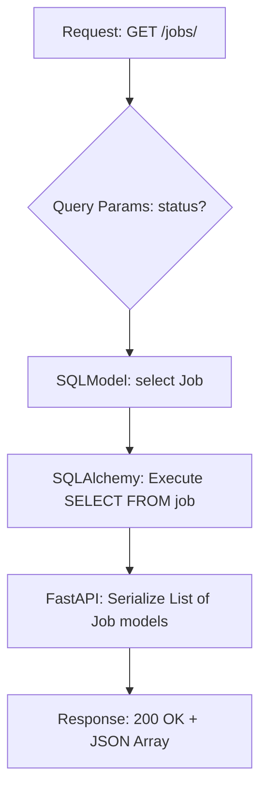
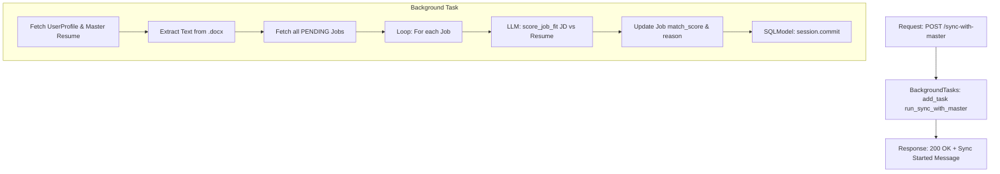
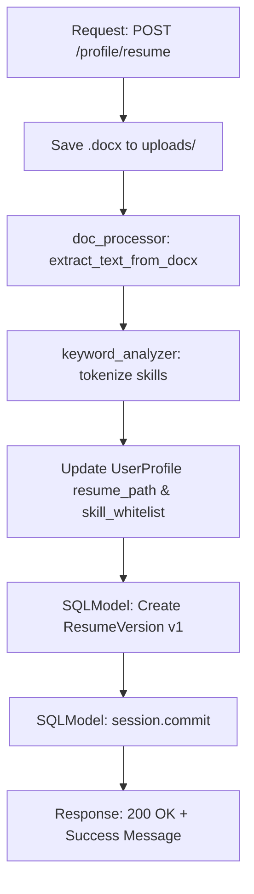
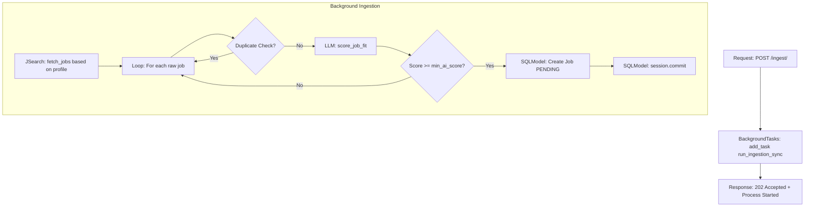
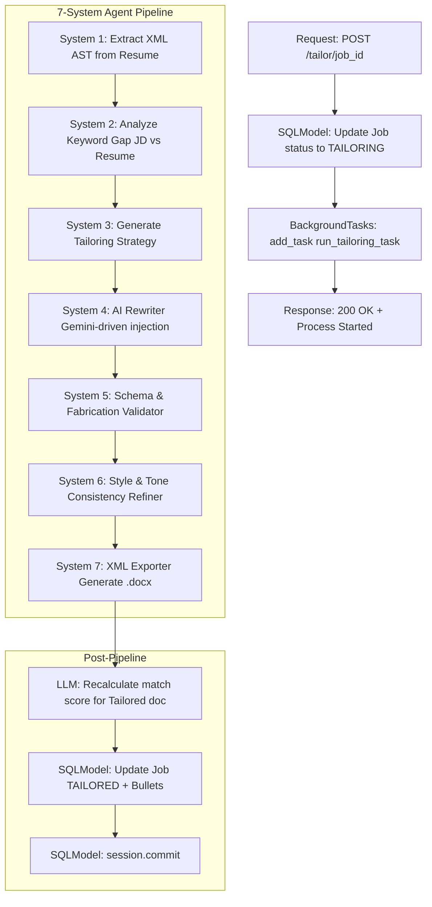
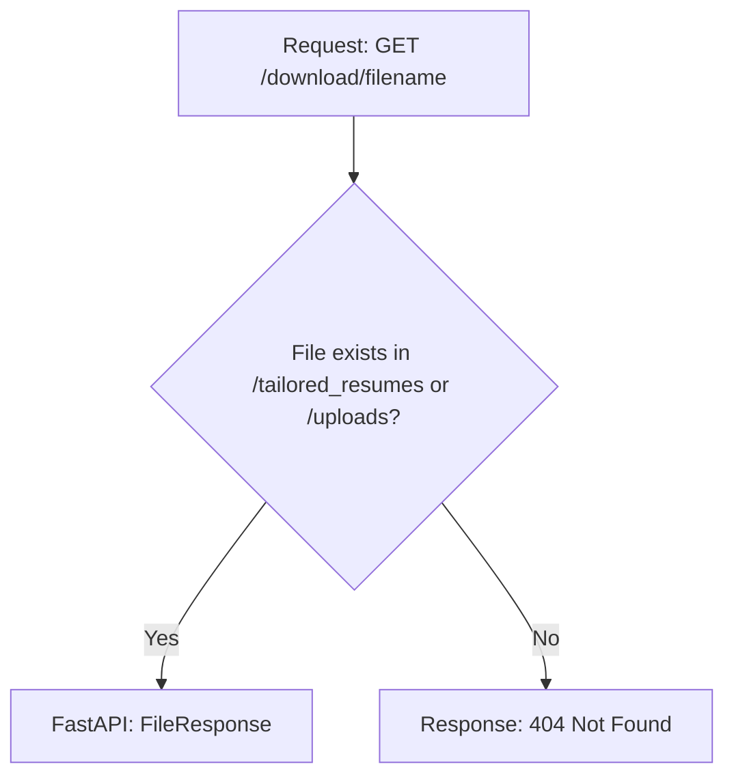

# AI Job Application Commander - Backend Flow Diagrams

This document outlines the request-to-response flow for the primary endpoints in the backend.

---

## 1. Jobs API

### `GET /jobs/`
Fetches a list of ingested jobs.

### `POST /jobs/sync-with-master`
Triggers background recalculation of match scores.

---

## 2. Profile API

### `POST /profile/resume`
Uploads a master resume and extracts initial data.

---

## 3. Ingestion API

### `POST /ingest/`
Triggers an automated job search and filtering loop.

---

## 4. Tailoring API (The 7-System Pipeline)

### `POST /tailor/{job_id}`
Triggers the full AI tailoring workflow.

---

## 5. File Download

### `GET /download/{filename}`
Serves tailored or uploaded documents.

